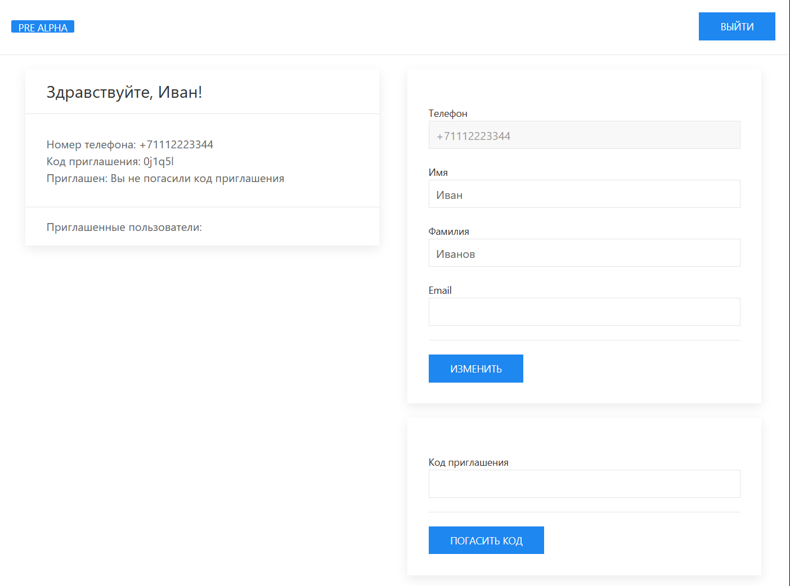

# Тестовое задание Hammer Systems

______________________________________

### Данная работа представляет собой приложение c API и UI интерфейсом

<p align="left">


</p>

______________________________________
**Приложение реализует простую реферальную систему**

Реализованная логика в соответствии с основными требованиями ТЗ:

1) Авторизация по номеру телефона. Первый запрос на ввод номера
   телефона. Имитировать отправку 4-значного кода авторизации
   (задержку на сервере 1-2 сек). Второй запрос на ввод кода;
2) Если пользователь ранее не авторизовывался, то записать его в бд;
3) Запрос на профиль пользователя;
4) Пользователю нужно при первой авторизации нужно присвоить
   рандомно сгенерированный 6-значный инвайт-код (цифры и символы);
5) В профиле у пользователя должна быть возможность ввести чужой
   инвайт-код (при вводе проверять на существование). В своем профиле
   можно активировать только 1 инвайт код, если пользователь уже когда-то
   активировал инвайт код, то нужно выводить его в соответсвующее
   поле в запросе на профиль пользователя;
6) В API профиля должен выводиться список пользователей (номеров
   телефона), которые ввели инвайт код текущего пользователя.

Дополнительно реализованный функционал:

1) UI интерфейс на Django Templates с применением UIkit
2) Документирование API с применением ReDoc
3) Контейнеризация с помощью Docker
4) Для удобства тестирования UI одноразовый пароль вводится автоматически
5) Для UI версии доступно изменение личных данных пользователя
6) Выход из профиля по API и через UI


______________________________________
**Используемый стек**

- Язык программирования: `Python 3.10`
- Фреймворк веб-приложений: `Django 4.2.4`
- Фреймворк для создания API: `Django Rest Framework 3.14.0`
- База данных: `PostgreSQL`
- Контейнеризация: `Docker`
- Плагин для автоматической генерации документации API: `drf-spectacular 0.26.4`
- Библиотека для работы с окружением: `django-environ 0.10.0`
- Frontend фреймворк `UIkit` для создания UI интерфейса приложения

______________________________________
**Основная структура проекта**

- `apps/`: папка с приложениями Django
- `apps/api/`: API составляющая приложения
- `apps/frontend/`: UI составляющая приложения
- `apps/users/`: приложение для работы с пользователями
- `config/`: папка с настройками приложения
- `.env`: файл с настройками окружения
- `docker-compose`: файл для запуска приложения через docker compose
- `Dockerfile`: файл для сборки Docker контейнера
- `manage.py`: файл для запуска Django команд
- `pyproject.toml`: файл для установки зависимостей через Poetry

______________________________________
**Установка и запуск приложения**

1) Клонируйте репозиторий
   ```sh
   git clone https://github.com/StasHunter92/hammer_systems_test.git
   ```

2) Запустите локальный сервер
   ```sh
   docker-compose up -d
   ```

3) UI интерфейс доступен по адресу: http://127.0.0.1

4) API документация доступна по адресу: http://127.0.0.1/api/v1/schema/redoc/

5) Управление данными через `adminer` доступно по адресу: http://127.0.0.1:8080/
    - Движок: `PostgreSQL`
    - Сервер: `hammer_systems_database`
    - Имя пользователя: `user`
    - Пароль: `password`